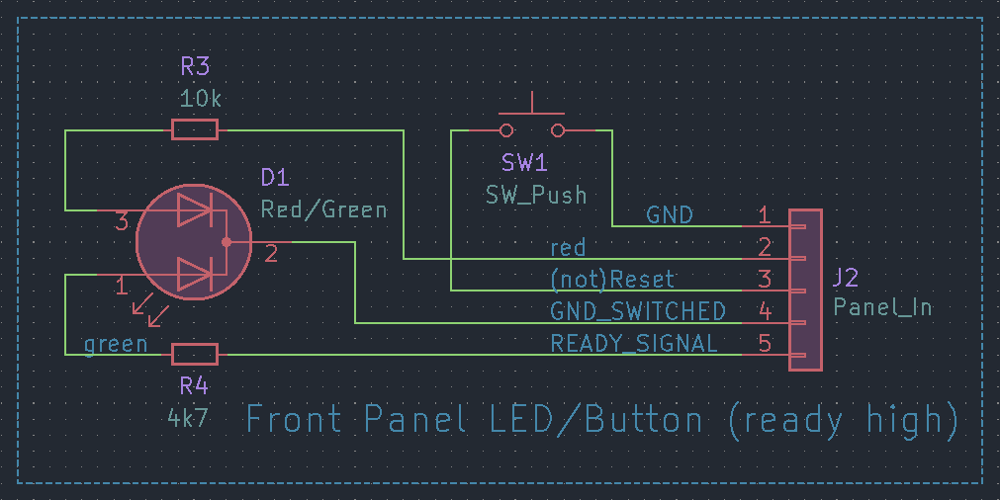
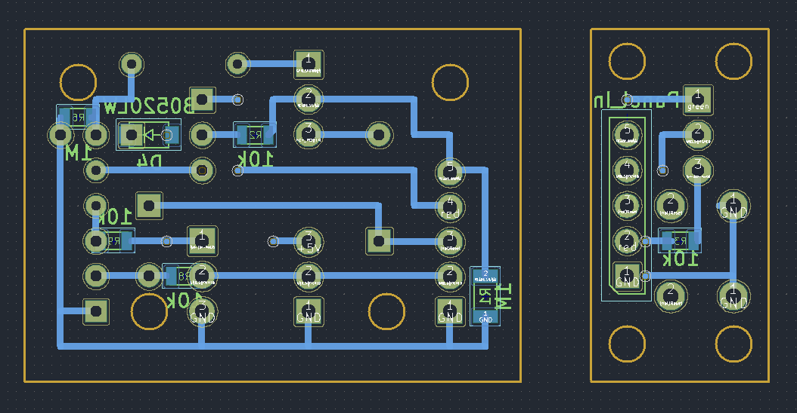

# GPIO Power Switch
Cut power to a single board computer (SBC) and attached components with a
MOSFET, power on and off with a button, indicate power and booted/ready status
with an LED.

 
<em>GPIO Power Switch</em>

-   [Rationale](#rationale)
-   [Overview](#overview)
-   [Hardware](#hardware)
    *   [Assembled](#assembled)
    *   [Schematic](#schematic)
    *   [Layout](#layout)
-   [Setup](#setup)
    *   [GPIO shutdown](#gpio-shutdown)
    *   [GPIO power key](#gpio-power-key)
    *   [Ready LED](#ready-led)

There's two different options, with the difference being whether the _ready_
status LED is switched on with a high or low signal from the GPIO pin.

## Rationale
Not all single board computers actually power off when they're shutdown, and
many will continue to power attached devices through the 3.3 and 5V pins on the
GPIO header.

The easiest way to deal with this is to cut power with a switch of our own,
making use of various signals to and from the GPIO supported by the linux kernel
to only cut power when the device has shutdown.

## Overview
This circuit carries out multiple functions:
-   MOSFET SR latch

    When 'reset' the power MOSFET is switched on, connecting the load to ground.
    When 'set' the power MOSFET is switched off, disconnecting the load from
    ground.

-   Push button

    If the MOSFET is off, when pressed 'resets' the MOSFET, connecting the SBC
    to ground and causing the SBC to boot. If the MOSFET is on, when pressed
    signals the SBC to shutdown by sending a _KEY_POWER_ event code via the GPIO.

-   Status LED

    Red when the MOSFET is switched on by default, can be changed to green with
    a GPIO signal to indicate the devices is booted, a particular system
    service has started, or whatever other criteria is set in software to toggle
    the relevant GPIO pin.

The basic connection between this circuit and the SBC involves three GPIO pins
and looks like this:

 
<em>Wiring overview</em>

The key thing to note is that the SBC runs off _GND_switched_.

This switch should work with any device that has a GPIO and supports
[gpio-poweroff][gpio-poweroff.txt] (to send a signal when shutdown is complete)
and [gpio-keys][gpio-keys.txt] (to accept a _KEY_POWER_ signal from the push
button).

## Hardware
### Assembled

 
<em>Assembled (ready high)</em>

### Schematic
There's three main sections of the circuit:

-   An SR latch handles cutting the power and retaining the state
-   A board for the button and LED, to mount on a panel
-   An interface between the GPIO and the other components

The latch is common to both the _ready high_ and _ready low_ circuits, but the
other sections differ.

 
<em>SR latch schematic</em>

 
<em>panel (ready low) schematic</em>

 
<em>interface (ready low) schematic</em>

 
<em>panel (ready high) schematic</em>

 
<em>interface (ready high) schematic</em>

### Layout

 
<em>ready low front layout</em>

 
<em>ready low back layout</em>

 
<em>ready high front layout</em>

 
<em>ready high back layout</em>

In this layout the push button and LED are mounted on a separate board from the
rest of the circuit, which allows easy mounting on a panel in an enclosure.
Obviously the layout can be changed as needed for any intended application.

> [!NOTE]
> The connecting cable between the two boards is not straight-through in this
> layout.Routing tracks on the prototype board is easier if the two boards are
> independent of each other in that regard, leaving the cable to handle routing
> between them.

## Setup
### GPIO shutdown
The _gpio-shutdown_ signal should be active high. Sending a 3.3V signal to
indicate we're shutdown (as opposed to pulling the pin low to ground) makes
sense because once the MOSFET cuts power to the SBC this high signal will fall
back to low.

This is important because the behaviour of the SR latch is undefined when both
_set_ and _reset_ are true at the same time, so we need the _gpio-shutdown_
signal from the GPIO to be low/false when it comes time to restore power, to
ensure the push button can reliably toggle the latch.

> [!NOTE]
> The _GPIO_SHUTDOWN_ signal requires `CONFIG_POWER_RESET_GPIO` and
> `CONFIG_POWER_RESET_GPIO_RESTART` to be enabled in the kernel, which may not
> be the case for a default OS install.

An example device tree overlay (from the
[moonbuggy/Orange-Pi-Zero-GPS-NTP][moonbuggy/Orange-Pi-Zero-GPS-NTP] project) is
available at [overlays/sun8i-h3-gpio-poweroff.dts](overlays/sun8i-h3-gpio-poweroff.dts).
In this example we're using pin 21 (_PA16_) on the Orange Pi Zero.

Reference: [gpio-poweroff.txt][gpio-poweroff.txt]

### GPIO power key
When the push button is pressed it will pull a GPIO pin to ground. Using
_gpio-keys_ we can create a device tree overlay to configure this pin as an input
key and assign a _KEY_POWER_ event code. (All available event codes are listed in
[include/uapi/linux/input-event-codes.h](https://git.kernel.org/pub/scm/linux/kernel/git/torvalds/linux.git/tree/include/uapi/linux/input-event-codes.h).)

An example overlay (also from the
[moonbuggy/Orange-Pi-Zero-GPS-NTP][moonbuggy/Orange-Pi-Zero-GPS-NTP] project) is
available at [overlays/gpio-key-power.dts](overlays/gpio-key-power.dts). In this
example we're using pin 12 (_PA07_) on the Orange Pi Zero, with _116_ being the
numeric code for _KEY_POWER_.

Reference: [gpio-keys.txt][gpio-keys.txt]

### Ready LED
Using a dual-colour LED, we have a default 'powered' indicator (red) that is on
whenever the power MOSFET is on. A high or low signal (depending on which board
is built) from a GPIO pin will switch this colour off and turn the second colour
(green) on, giving us a 'ready' signal.

The intention is that the change in LED colour should be triggered by software
and indicate that the OS is booted, a service has started or some other specific
condition has been met and the device is usable.

The simplest way to manage this is with a _systemd_ service executing `gpioset`
commands at appropriate times. Once again,
[moonbuggy/Orange-Pi-Zero-GPS-NTP][moonbuggy/Orange-Pi-Zero-GPS-NTP]
provides an example in the
[Status LED section](https://github.com/moonbuggy/Orange-Pi-Zero-GPS-NTP#status-led).
In this application, the device is considered 'ready' once _chrony_ and _gpsd_
are running and we're using pin 16 (_PA19_) for the signal.

The current limiting resistors will need to be adjusted for the specific LED in
use and the desired brightness.

[moonbuggy/Orange-Pi-Zero-GPS-NTP]: https://github.com/moonbuggy/Orange-Pi-Zero-GPS-NTP
[gpio-poweroff.txt]: https://www.kernel.org/doc/Documentation/devicetree/bindings/power/reset/gpio-poweroff.txt
[gpio-keys.txt]: https://www.kernel.org/doc/Documentation/devicetree/bindings/input/gpio-keys.txt
